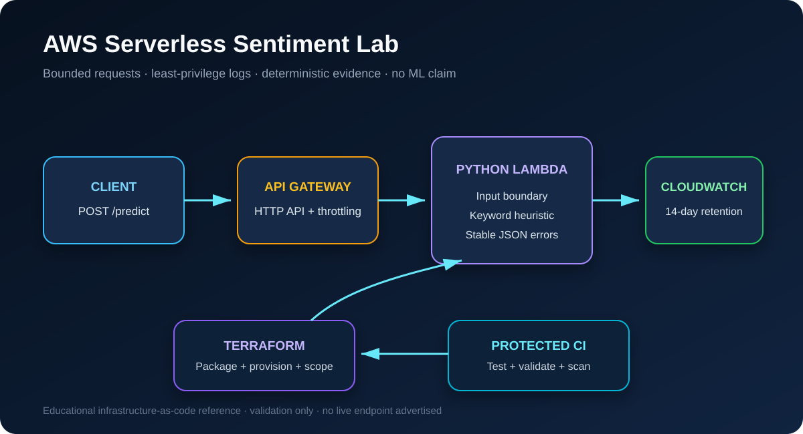
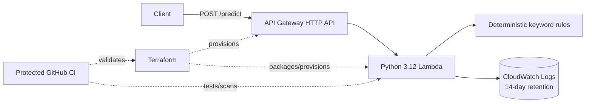

# AWS Serverless Sentiment Lab

Terraform-defined API Gateway and Lambda reference architecture with bounded
request handling, least-privilege logging, deterministic tests, and protected
delivery.

[Architecture](docs/ARCHITECTURE.md) ·
[Security](SECURITY.md) ·
[Contributing](CONTRIBUTING.md) ·
[Limitations](#scope-and-limitations)



## 30-second engineering overview

- HTTP API exposes one `POST /predict` route through AWS API Gateway.
- Python 3.12 Lambda validates object shape, text type, and a 2,000-character limit.
- A transparent keyword heuristic returns positive, negative, or neutral evidence.
- Terraform packages the function, scopes log-write permissions, retains logs for
  14 days, and applies bounded route throttling.
- Twelve unit tests cover valid behavior, malformed JSON, wrong types, blank and
  oversized input, token matching, and stable error responses.
- CI verifies Python, Terraform, privacy-safe current/history content, dependency
  changes, and CodeQL before protected merges.

This is an educational serverless and infrastructure-as-code lab. It does not
deploy or invoke a machine-learning model and does not claim production readiness.

## Evidence map

| Engineering concern | Tracked evidence |
|---|---|
| Request boundary | [Lambda handler](lambda/app.py) and 12 regression tests |
| Infrastructure | API Gateway, Lambda, IAM, CloudWatch, packaging, and outputs under [terraform/](terraform/) |
| Least privilege | Function-specific log-group policy in [lambda.tf](terraform/lambda.tf) |
| Cost/abuse controls | 10 requests/second with burst 20 in [api_gateway.tf](terraform/api_gateway.tf) |
| Reproducibility | Provider lock, unit tests, Terraform validation, and protected CI |
| Public safety | Current and complete-history scanner in [repository_safety.py](scripts/repository_safety.py) |

## Request and response

Request:

```json
{
  "text": "I love this workshop"
}
```

Response:

```json
{
  "input_text": "I love this workshop",
  "label": "POSITIVE",
  "method": "keyword_heuristic",
  "matched_keywords": {
    "positive": ["love"],
    "negative": []
  }
}
```

The response exposes its method and matched evidence instead of presenting a
synthetic confidence value as model output.

## Architecture



See [docs/ARCHITECTURE.md](docs/ARCHITECTURE.md) for request, security, and
deployment boundaries.

## Local verification

Requirements:

- Python 3.12+
- Terraform 1.5+

```bash
python -m unittest discover -s tests -p "test_*.py" -v
python -m compileall -q lambda tests scripts
python scripts/repository_safety.py --self-test
python scripts/repository_safety.py --current
python scripts/repository_safety.py --history
terraform -chdir=terraform fmt -check -recursive
terraform -chdir=terraform init -backend=false
terraform -chdir=terraform validate
```

These commands do not create AWS resources. Review `terraform plan` and your
account-specific cost/security requirements before any deployment.

## Deployment outline

1. Configure AWS credentials outside the repository.
2. Review variables, names, IAM, throttling, logging, and the Terraform plan.
3. Run `terraform -chdir=terraform apply` only in an authorized AWS account.
4. Use the `api_invoke_url` output with `POST /predict`.

No credentials, state, variable values, or deployment outputs belong in Git.

## Technical decisions

- **Heuristic, not ML:** deterministic rules keep the lab inspectable and prevent
  an unsupported SageMaker claim.
- **Stable errors:** client failures return documented messages without exception
  details or stack traces.
- **Bounded input:** text is trimmed and capped before classification.
- **Scoped logging:** Lambda can write only to its provisioned log group.
- **Compatibility preserved:** historical AWS resource names remain unchanged
  because live deployment state is unknown.
- **No automatic apply:** CI validates infrastructure but never mutates AWS.

## Scope and limitations

- The classifier uses a tiny authored keyword set; it is not suitable for real
  sentiment analysis, safety decisions, or business analytics.
- The project has no authentication, WAF, custom domain, persistence, model
  endpoint, deployment pipeline, load test, alarm, or live availability evidence.
- Throttling and finite log retention are lab defaults, not production sizing.
- A production system would require threat modeling, authentication/
  authorization, WAF/rate strategy, alarms, traces, budgets, model evaluation,
  data governance, and environment-specific deployment controls.
- No live AWS endpoint is advertised because one was not verified during this
  release audit.

## License

Released under the [MIT License](LICENSE).
